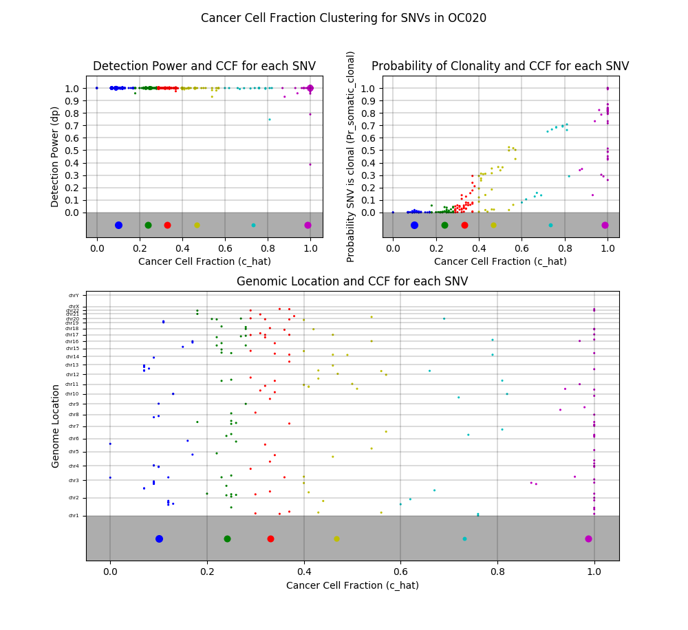

AbsMafAnalyzer Workflow
=======================

The AbsMafAnalyzer workflow can be used to visualize the data from an *ABS_MAF.txt absolute file output.
Detection power, multiplicity, and genomic locus are plotted for all SNPs, along with clustering information based
on cancer cell fraction.

Example Output
--------------

An example plot describing the SSD dropoff for different values of k can also be found in the example_plots folder.

Installation
------------
Add abs_maf_analyzer and k_means_abs_maf folders into your project folder.
Ensure the libraries specified in the requirements.txt file are available in your working environment.
If not, simply run `pip install -r requirements.txt`.
Then, as described below, just import the AbsMafAnalyzer class from the abs_maf_analyzer package.

Parameters
----------
The following parameters can be provided to an AbsMafAnalyzer object:
* `abs_maf_path`: The path to the *ABS_MAF file to be analyzed.

* `detection_power_threshold`: A threshold for detection power. By default there is no threshold; if one is set, only SNPs with a detection power above the given threshold will be analyzed and plotted.

* `accession`: The accession for the sample. It will be used to title the output plots.

* `exclude_silent`: If set to True, only SNPs with a non-silent effect will be analyzed and plotted.

* `k_ranges`: By default k-means will test k-values between 1 and 10. A customized range of k-values can be tested instead by supplying such a list for this parameter.

Example Usage
-------------
Example usages in a script:

    from abs_maf_analyzer.abs_maf_analyzer import AbsMafAnalyzer

    def main():
        path = '/Users/erickofman/Documents/Projects/OralCancer/OCSCC-OC011-TP-NB-SM-F3R74-SM-F3R84_ABS_MAF.txt'
        a = AbsMafAnalyzer(path, accession="OC011")

        # k is not specified -- all values of k between 1 and 10 will be tested for optimal number of clusters. This
        # takes around 12 seconds.
        a.cluster()

        path = '/Users/erickofman/Documents/Projects/OralCancer/OCSCC-OC011-TP-NB-SM-F3R74-SM-F3R84_ABS_MAF.txt'
        b = AbsMafAnalyzer(path, accession="OC011")

        # k is specified -- value specified will be used for number of clusters
        b.cluster(k=5)

    if __name__ == '__main__':
        main()

* The k-means implementation used here, which leverages pandas, is very loosely based on an implementation by Jack Maney,
which can be found here: https://github.com/jackmaney/k-means-plus-plus-pandas. Significant changes were made to
improve the conciseness, accuracy, and clarity of the code in the aforementioned framework.
